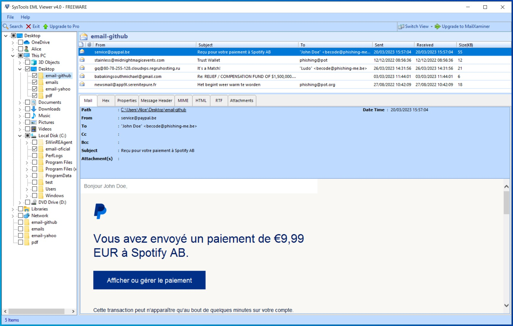
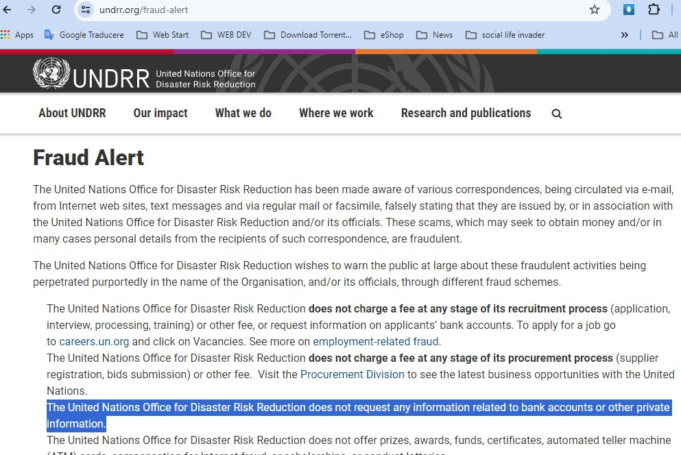

# Phising

I will analyze the following email files to find out who sent them and the purpose.

- email_1.eml
- email_2.eml
- email_3.eml
- email_4.eml
- email_5.eml

I will use the following programs for the WINDOWS operating system to see the RAW content of *.EML files:

- Total commander
- notepad
- SysTools EML Viewer Tool

### SysTools EML Viewer Tool

This program displays all the details of an email file and is very good for advanced analysis. It is free and can be downloaded from:

```
https://www.systoolsgroup.com/eml-viewer.html
```

I load the 5 *.EML files, the details can be seen in the following image



### email_1.eml

From : service[@]paypal[.]be

return path : service[@]paypal[.]be

to: "John Doe" <becode[@]phishing-me[.]be>

subject: Reçu pour votre paiement à Spotify AB

date sent: 20/03/2023 15:57:04

sender IP:  66[.]211[.]170[.]87


https://www.whois.com/whois/66.211.170.87

```
#
# ARIN WHOIS data and services are subject to the Terms of Use
# available at: https://www.arin.net/resources/registry/whois/tou/
#
# If you see inaccuracies in the results, please report at
# https://www.arin.net/resources/registry/whois/inaccuracy_reporting/
#
# Copyright 1997-2024, American Registry for Internet Numbers, Ltd.
#


NetRange:       66.211.168.0 - 66.211.171.255
CIDR:           66.211.168.0/22
NetName:        PAYPAL-SITE
NetHandle:      NET-66-211-168-0-1
Parent:         NET66 (NET-66-0-0-0-0)
NetType:        Direct Allocation
OriginAS:       AS17012
Organization:   PayPal, Inc. (PAYPAL)
RegDate:        2006-01-25
Updated:        2021-12-14
Ref:            https://rdap.arin.net/registry/ip/66.211.168.0


OrgName:        PayPal, Inc.
OrgId:          PAYPAL
Address:        2211 N. First St.
City:           San Jose
StateProv:      CA
PostalCode:     95131
Country:        US
RegDate:        2001-08-17
Updated:        2019-04-10
Ref:            https://rdap.arin.net/registry/entity/PAYPAL


OrgAbuseHandle: NETWO8902-ARIN
OrgAbuseName:   Network Abuse
OrgAbusePhone:  +1-480-967-5100 
OrgAbuseEmail:  email@paypal.com
OrgAbuseRef:    https://rdap.arin.net/registry/entity/NETWO8902-ARIN

OrgTechHandle: PAYPA-ARIN
OrgTechName:   PayPal Network
OrgTechPhone:  +1-408-967-5100 
OrgTechEmail:  email@paypal.com
OrgTechRef:    https://rdap.arin.net/registry/entity/PAYPA-ARIN

RNOCHandle: PAYPA1-ARIN
RNOCName:   PayPal
RNOCPhone:  +1-480-967-5100 
RNOCEmail:  email@paypal.com
RNOCRef:    https://rdap.arin.net/registry/entity/PAYPA1-ARIN

RTechHandle: PAYPA1-ARIN
RTechName:   PayPal
RTechPhone:  +1-480-967-5100 
RTechEmail:  email@paypal.com
RTechRef:    https://rdap.arin.net/registry/entity/PAYPA1-ARIN

RAbuseHandle: NETWO8902-ARIN
RAbuseName:   Network Abuse
RAbusePhone:  +1-480-967-5100 
RAbuseEmail:  email@paypal.com
RAbuseRef:    https://rdap.arin.net/registry/entity/NETWO8902-ARIN


#
# ARIN WHOIS data and services are subject to the Terms of Use
# available at: https://www.arin.net/resources/registry/whois/tou/
#
# If you see inaccuracies in the results, please report at
# https://www.arin.net/resources/registry/whois/inaccuracy_reporting/
#
# Copyright 1997-2024, American Registry for Internet Numbers, Ltd.
#

```

After analyzing this file, I came to the conclusion that it is sent by paypal.com. All the details, including the IP address, show that it is a clean email.


### email_2.eml

From :  "noreply" <stainless[@]midnightmagicevents[.]com>

return path : stainless[@]midnightmagicevents[.]com

to: phishing@pot

subject: Trust Wallet

date sent: 12/12/2022 08:56:36

sender IP:  172[.]81[.]119[.]154

```
NetRange:       172.81.116.0 - 172.81.119.255
CIDR:           172.81.116.0/22
NetName:        IMH-EAST
NetHandle:      NET-172-81-116-0-1
Parent:         NET172 (NET-172-0-0-0-0)
NetType:        Direct Allocation
OriginAS:       AS54641
Organization:   InMotion Hosting, Inc. (INMOT-1)
RegDate:        2015-05-13
Updated:        2015-05-13
Ref:            https://rdap.arin.net/registry/ip/172.81.116.0


OrgName:        InMotion Hosting, Inc.
OrgId:          INMOT-1
Address:        555 S Independence Blvd
City:           Virginia Beach
StateProv:      VA
PostalCode:     23452
Country:        US
RegDate:        2008-06-03
Updated:        2022-07-21
Ref:            https://rdap.arin.net/registry/entity/INMOT-1
```
Accessing the link into the virtual machine, the following picture shows the suspicious content full of advertisements with unknown Internet addresses that may contain dangerous payload.

`hxxp[://]www[.]midnightmagicevents[.]com`

![hxxp[://]www[.]midnightmagicevents[.]com](assets/mn.jpg)

This email is very strange.

It's certainly not what it claims to be.

The name midnightmagicevents comes from an event organizer, for example weddings. And the "go to verification" verification button leads to the following internet address:

 `hxxps[://]climovil[.]com`

 ![hxxps[://]climovil[.]com](assets/climovil.jpg)
 
 which sells cooling equipment. And the content of the email shows that it is about verifying the cryptocurrency etherum account

In conclusion, it is a PHISHING because it tries to put fear in the person who reads, and rushes him to log into the unknown source in order to lose the money.

### email_3.eml

From : gq[@]80-78-255-128[.]cloudvps[.]regruhosting[.]ru

return path : gq[@]80-78-255-128[.]cloudvps[.]regruhosting[.]ru

to: "Ludo" <becode@phishing-me.be>

subject: It's a Match!

date sent: 26/03/2023 14:31:56

sender IP:  80[.]78[.]255[.]128

This email is 100% Phishing

The email address is from an unknown source with a strange name, and the content of the message urges you to log in to a website 'tinder.com'  of love meetings, to find the right pair. but the button leads to the fraudulent address

`hxxp[://]blog[.]tulingxueyuan[.]cn[/]contradictedqm[.]php`

The official address for Tinder is https://tinder.com/ and all their emails end with @gotinder.com

### email_4.eml

From : Dr. Dan Miller babakingsouthmichael[@]gmail[.]com

return path : imorourafiatou0@gmail.com

Reply-To: imorourafiatou0@gmail.com

to Bcc : becode@phishing-me.be

subject: Re: RELIEF / COMPENSATION FUND OF $1,500,000.00 USD

date sent: 03/03/2023 11:44:01

sender IP:  

This email is phishing. The person writing the message claims to be Dan Miller. His name is not the same as the name of the email

International phone number: +229 is Benin from Africa

On **UN Office for Disaster Risk Reduction, UNDRR**

With the official web address

https://www.undrr.org/fraud-alert

"The United Nations Office for Disaster Risk Reduction does not request any information related to bank accounts or other private information."



### email_5.eml

From : Ariana newsmail[@]app9l[.]serenitepure[.]fr

return path : service[@]paypal[.]be

to: phishing@pot.org

subject: Het begint weer warm te worden

date sent: 27/08/2022 10:42:09

sender IP:  51[.]83[.]34[.]109

This email is phishing.

Serenitepure is a name used by a therapy and massage company, and in this email Serenitepure uses this name to trick people into sending information to:

`hxxtp[://]secure-netcloud[.]com/?a=71&amp;c=76&amp;s1=dadaa&amp;email=phishing@pot.org`

 With the aim of finding dates on whatsapp.

https://www.whois.com/whois/51.83.34.109

```% This is the RIPE Database query service.
% The objects are in RPSL format.
%
% The RIPE Database is subject to Terms and Conditions.
% See https://apps.db.ripe.net/docs/HTML-Terms-And-Conditions

% Note: this output has been filtered.
%       To receive output for a database update, use the "-B" flag.

% Information related to '51.83.34.0 - 51.83.35.255'

% Abuse contact for '51.83.34.0 - 51.83.35.255' is 'email@ovh.net'

inetnum:        51.83.34.0 - 51.83.35.255
netname:        PCI-SBG5
country:        FR
org:            ORG-OS3-RIPE
admin-c:        OTC2-RIPE
tech-c:         OTC2-RIPE
status:         LEGACY
mnt-by:         OVH-MNT
created:        2019-02-19T10:09:44Z
last-modified:  2019-02-19T10:09:44Z
source:         RIPE

organisation:   ORG-OS3-RIPE
org-name:       OVH SAS
country:        FR
org-type:       LIR
address:        2 rue Kellermann
address:        59100
address:        Roubaix
address:        FRANCE
phone:          +33972101007
admin-c:        OTC2-RIPE
admin-c:        OK217-RIPE
admin-c:        GM84-RIPE
abuse-c:        AR15333-RIPE
mnt-ref:        OVH-MNT
mnt-ref:        RIPE-NCC-HM-MNT
mnt-by:         RIPE-NCC-HM-MNT
mnt-by:         OVH-MNT
created:        2004-04-17T11:23:17Z
last-modified:  2020-12-16T10:24:51Z
source:         RIPE # Filtered

role:           OVH Technical Contact
address:        OVH SAS
address:        2 rue Kellermann
address:        59100 Roubaix
address:        France
admin-c:        OK217-RIPE
tech-c:         GM84-RIPE
tech-c:         SL10162-RIPE
nic-hdl:        OTC2-RIPE
abuse-mailbox:  email@ovh.net
mnt-by:         OVH-MNT
created:        2004-01-28T17:42:29Z
last-modified:  2014-09-05T10:47:15Z
source:         RIPE # Filtered

% Information related to '51.83.0.0/16AS16276'

route:          51.83.0.0/16
origin:         AS16276
mnt-by:         OVH-MNT
created:        2019-02-13T09:04:13Z
last-modified:  2019-02-13T09:04:13Z
source:         RIPE

% This query was served by the RIPE Database Query Service version 1.112 (SHETLAND)```
